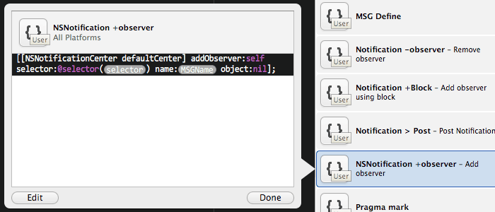

< [Back](README.md)

Code Snippet
=====

代码片段可能是 Xcode 中被忽略最多的功能了，而且很可能你每天都在用它。善用之能极大提高编码效率，应当重视。

内置代码片段
----

看看下面两幅截图：

眼熟吧。注意到备选项前面的图标了吗，灰色的括号，这表示这个备选项是代码片段提供的。

事实上 Xcode 已经为 OS X 和 iOS 开发内置了一组代码片段了，一部分是常用语法的快捷补全，就像上面两个例子那样。剩下的有些示例的味道，比如跟 Core Data 有关的代码片段们：

还有 KVO 的：

很贴心。

自定义代码片段
----

代码片段是可以创建的，拖拽选中代码段到 Code Snippet Library 即可创建。

在列表中选中指定项按 <kbd>delete</kbd> 键即可删除。

你可以随时编辑你的代码片段，编辑界面像下面那样：

`Completion Shortcut` （自动补全快捷键）是最重要的一项，设置好关键字后就可以在编辑器中输入相应关键字后出现补全提示，否则代码片段只能拖拽到编辑器中使用。`Title` 和 `Summary` 会在补全提示时显示。指定 `Language` 和 `Completion Scopes` 可以让代码片段只在特定区域显示补全提示，在你拖拽创建代码片段时，Xcode 会根据你的拖拽区域自动指定它们。

代码片段中的占位符可以按 `<#占位符提示#>` 格式添加。

细节：

> 自动补全快捷键可以包含小部分特殊符号，已知的有 `@`, `$`。除 `@` 外，其他符号虽然也可以填入，但会从其所在位置起导致快捷键失效（比如快捷键为 `$+`，输入 `$` 弹出提示后，再输入 `+`，则提示消失）

Tips：
    
> 如果自动补全提示没有出现可以试试将 `Language` 改成 `Objective-C`。

用户自定义的代码片段存放于 `~/Library/Developer/Xcode/UserData/CodeSnippets`。

实战：我是如何使用代码片段的
----
目前我在使用的代码片段超过50个，对其非常依赖。这么多项，补全快捷键的管理是个问题，说说我的管理方案。

像方法内的代码片段或某些声明直接用正常书写的前几个字符。这样做不像用缩写，没有任何记忆负担，你可以像没有相应代码补全一样正常书写，代码片段的补全会随之出现。举例说明：

如上图所示，我定义了几个和通知有关的代码片段，补全快捷键我全都设置成了“NSNotification”，平时使用通知肯定要和 NSNotificationCenter 打交道，没等 NSNotificationCenter 打完补全就出现了：

再如，为了快速声明属性，我有一组代码片段：

快捷键 | 代码片段内容
-----|----
@pa  | @property(assign, nonatomic) <#type#> <#name#>;
@pc  | @property(copy, nonatomic) NSString *<#var#>;
@pr  | @property(readonly, nonatomic) <#type#> <#name#>;
@prw | @property(readwrite, nonatomic) <#type#> <#name#>;
@ps  | @property(strong, nonatomic) <#type#> <#name#>;
@pw  | @property(weak, nonatomic) <#type#> <#name#>;
@pblock  | @property(copy, nonatomic) void (^<#block name#>)(void);
@pi  | @property(weak, nonatomic) IBOutlet <#type#> <#name#>;
@pic | @property(strong, nonatomic) IBOutletCollection(<#Class#>) NSArray *<#var#>;

用时方便快捷：

如果补全的是一个或多个完整的方法，我通常用 `@` 作为开头，不赘述了，可以到 https://github.com/BB9z/xcode-config/tree/master/UserData/CodeSnippets 获取我的代码片段试一试。
