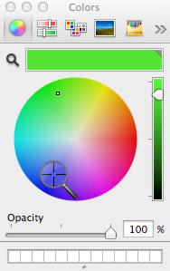

< [Back](README.md)

系统颜色拾取器插件
====

在 Xcode 中取色的话，可能没必要动用像 [Sip](https://itunes.apple.com/us/app/sip/id507257563?mt=12) 或 [xScope](https://itunes.apple.com/us/app/xscope/id447661441?mt=12) 这样的重型工具。

系统的颜色拾取器本身支持抓取屏幕上的颜色：

特定情景下有些插件很好用：

* Hex Color Picker 
    http://wafflesoftware.net/hexpicker/ 
    推荐，如果要跟十六进制格式打交道的话，这个是必备的

* Developer Color Picker
    http://panic.com/~wade/picker/
    特色是可以直接拷贝 NSColor、UIColor 等格式的代码声明

* Pro Picker
    http://www.irradiated.net/?page=pro-picker
    可以精细地调节颜色，适合设计师
    
把下载好后的插件放在 `~/Library/ColorPickers` 重启相关应用即可。