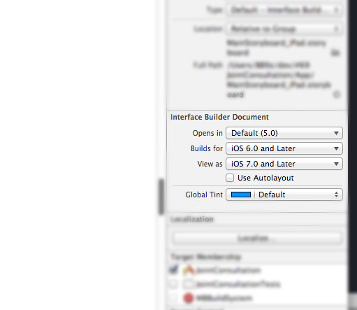

写在前面
-----
我发现身边有些这样的人：

* 遇到错误不看错误信息就开始胡乱试着改正的
* 基础的问题，不看文档，不去搜索就开始找人的
* 遇到问题无从下手的

所以，这个系列，我想通过展示自己是如何分析解决问题，给有类似情况的人一些指引，得到启发并提高自身解决问题的能力。

问题描述
----
Xcode 更新到 5 之后，用户反映应用在 iOS 5 上闪退。

解决步骤及动机分析
----

1. 解决这个问题首先要找到闪退的原因，因为用户没有提供额外的信息，只能自己跑跑看了。

2. 在 iOS 5 模拟器上跑了一下，果然一启动就报异常了：

    ```
*** Terminating app due to uncaught exception 'NSInternalInconsistencyException',
reason: 'The NIB data is invalid.'
```

3. 阅读这段错误信息，异常的原因是“The NIB data is invalid”，nib 文件的格式不正确？

4. 因为以前没有这种问题，基本可以断定是升级了 Xcode 5 导致的。首先想到的是检查一下 Stroryboard 的设置：
    

5. 其中有一项是 Builds for，里面的设置是 iOS 6 及之后，那八成跟这个选项有关。

6. 把这个选项改成 iOS 5 再试，<kbd>⌘+R</kbd> 运行，结果产生了编译错误：

    ```
Class Unavailable: UICollectionViewLayout on iOS versions prior to 6.0
Class Unavailable: UICollectionView on iOS versions prior to 6.0
Class Unavailable: UICollectionReusableView on iOS versions prior to 6.0
```

7. 看这个错误信息，很清楚的报告了 UICollectionView 只在 iOS 6 之后可用，而我们现在让它编译为 iOS 5 的版本。

8. 现在等于我们在未解决第一个问题的情况下又遇到了第二个问题，那我们现在怎么做？有两种方式，先解决第二个问题，然后继续解决前面的问题；另一个是把第二个问题独立出来，继续解决第一个问题，回头再来解决第二个。

9. 两种方式没有绝对的优劣，实际上我们先验证了 Builds for iOS 5 的选项可以解决在 iOS 5 运行的问题后再去解决 Collection View 的问题的。

10. 验证的办法我想到两个，一种是建一个新项目，改参数去验证，工作量不大，熟练的不用3分钟吧。另一种是临时去掉第二个问题因素的影响，这个例子就是删掉 Storyboard 中的 UICollectionView，完事后通过版本控制工具撤销掉实验性修改，恢复正常进度。

11. 解决第一个问题后，就可以开始解决第二个问题了。这个项目我们用第三方的 PSTCollectionView 来让 UICollectionView 支持 iOS 5 的，乍看上去没有什么思路——Stroyboard 必须按 iOS 5 编译，但 UICollectionView 只在 iOS 6 后可用。

12. 这种情况目前想到的办法只有完全用代码写。但在动手前还是先搜索一下其他人是如何解决的（至于有没有人遇到的问题不用考虑了，Xcode 5 Beta 了那么长时间要有这问题肯定都遇到了）。

13. 搜索的话一般无非 Google、Stack Overflow，但是当时我的直觉是到 GitHub 上看看，也没想太多。现在如果非要列理由的话，大概是：
    * PSTCollectionView 项目本身开发比较活跃，而且其维护人 Peter Steinberger 很靠谱，如果这种问题存在，官方应该已经解决的可能性很大。这应该是最重要的考量因素；
    * PSTCollectionView 是一个第三方库，受众相对来说较小，到项目的页面上找资源可能更丰富一些。事后在 Stack Overflow 上搜索 PSTCollectionView 的结果才不到两页。
    
14. 于是到项目页面首先看了一下最近的提交情况，提交频度挺高，不错。这么做是确认这个项目还在积极维护中，状态是良好的。

15. 然后我更新了一下本地的 clone，试着跑了一下其中的 demo，不过很失望，也存在这种问题。

16. 既然最新的版本也这样，那只能到 Pull Requests 和 Issues 看看了。Pull Requests 没有，直接去看 Issues。

17. Open 的 Issues 有 50 个左右，而且不少都是很久以前的了，5个月内活跃的只有十多个：
    * Performance Improvement: Hide cells instead of removing them
    * Compilation error when used with other common source libraries
    * PSTCollectionView crach on IOS 5 when scroll
    * Collection View will not scroll when VoiceOver is activated on iPad
    * Lazy loaded collection view does not call viewDidLoad prevAttr initialized to nil and can cause an exception in NSDictionary literal
    * Crashes on iOS < 6.0
    * Decoration views not working properly
    * Assertion topLevelObjects.count == 1 is not neccessary (?)
    * PSTCollectionViewLayout layoutAttributesForDecorationViewOfKind:indexPath: always uses static elementKind of PSTCollectionElementKindDecorationView
    * Selected issue
    * Highlight color doesn't disappear
    * Line Layout with imageView, odd behaviour
    * Issue when subclassing PSUICollectionViewFlowLayout
    
18. 看标题只有“Crashes on iOS < 6.0”这个符合，但进去看了不是我们遇到的问题，其他的也是一样。

19. 还不放弃，看看关闭的吧，已经关的 Issues 很多，但因为是最近的问题，所以不必看很多，前两页足够了（除了时间、评论个数也比较有参考价值）。如果以 iOS 5 为关键字的话，稍微“贴边”的有：

    a. PSTCollectionView crach on IOS 5 when scroll
    b. PSUICollectionViewCell's user interaction flag not working for iOS5
    c. Correctly decoding reuseIdentifier when loading from Nib
    d. How to use PSTCollectionView in Xcode 5 with Base SDK iOS 7, and minimum supported version of iOS 5
    e. compile error in ios5.1
    
    这里面真正符合我们问题的其实只有 d 和 e，而且也正是在 d 中得到的答案。链接奉上： https://github.com/steipete/PSTCollectionView/issues/344
    
以上就是解决的全过程。

多说一句，Cocoa 的错误信息通常都很准确，说的是哪里的问题就是哪里的。

 
