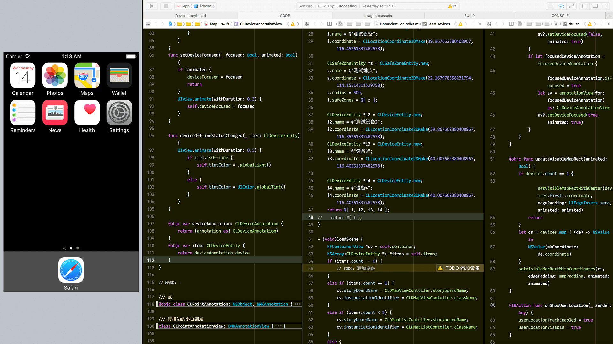

# 优化工作区

< [Back](README.md)

## 一键切换工作区

<todo:效果视频>

设置方法：Xcode 设置 > Behaviors: 点右下角加号建立新 Behavior，点右侧 ⌘ 区域可以设置热键。

<todo:截图>

贴下我的配置供参考：

* 代码模式，Command+1：[Show] navigator [Project]，[Hide] debugger，[Hide] inspectors，[Show] toolbar
* UI 模式，Command+2：[Hide] navigator，[Hide] debugger，[Show] inspectors，[Hide] toolbar
* 调试模式，Command+7：[Show] navigator [Debug]，[Show] debugger with [Current Views]，[Hide] inspectors
* 日志模式，Command+9：[Show] navigator [Local]，[Hide] debugger，[Hide] inspectors，[Navigate] to [current log]

默认 Command+数字键是在左侧导航 tab 间切换的，设置时会提示热键冲突，点 replace 替换即可。

## Tips: 模拟器和 Xcode 全屏并列显示

先看效果，虽然损失些编辑空间，但是窗口管理省心了：



默认模拟器是不可以全屏显示的，打开一个隐藏开关就能支持全屏了，在终端执行：

```shell
defaults write com.apple.iphonesimulator AllowFullscreenMode 1
```
